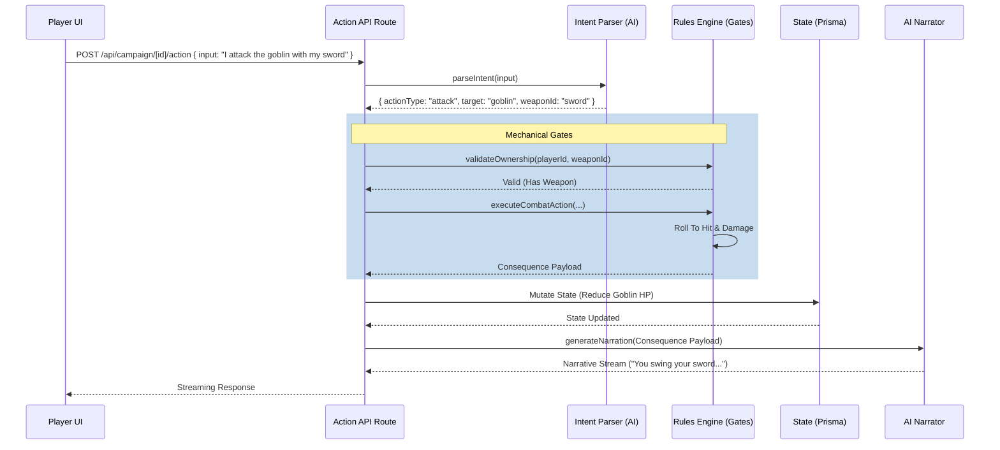

# Milestone Walkthrough: Dungeon Cortex State

## 1. La "Trifuerza de Datos" (Completada)

El sistema ha establecido una base robusta y 100% funcional conocida como la "Trifuerza de Datos", adhiriéndose estrictamente al pilar "Code is Law".

1.  **SRD Ingestion (Monstruos, Hechizos, Equipamiento):**
    Los datos del System Reference Document (SRD) se ingieren, validan con Zod y se almacenan en las tablas de Prisma (`SrdMonster`, `SrdSpell`, `SrdItem`). Las herramientas de IA (`lib/ai/tools/srd-lookup.ts`) pueden consultarlos con total seguridad de tipos.

2.  **Combat Engine & Intent Parsing:**
    El motor de combate centralizado en `lib/rules/combat.ts` (`executeCombatAction`, `finalizeEncounterTurn`) soporta daños, curaciones y condiciones. El módulo `lib/ai/intent.ts` traduce de manera estructurada el lenguaje natural del jugador hacia intenciones mecánicas.

3.  **Inventory Management:**
    El manejo de inventario (`lib/rules/inventory.ts`) está asegurado con "Gates" o compuertas lógicas (e.g. `validateOwnership`, `equipItem`, `useConsumable`). Un jugador no puede usar un objeto que no posee.

---

## 2. Diagrama de Flujo: De la UI a la Narración

El ciclo de resolución de una acción en Dungeon Cortex sigue un pipeline estricto. El Narrador (IA) solo narra resultados validados mecánicamente.

---

## 3. Prioridad 7: Motor de Exploración y Tiempo (Completada)

El Motor de Exploración (`lib/rules/exploration.ts`) ha sido integrado exitosamente, implementando la gestión del tiempo y recursos bajo reglas SRD/OSR.

### Capacidades Implementadas:
*   **Reloj de Mazmorra (Dungeon Clock):** Sistema de turnos de 10 minutos. 6 turnos = 1 hora.
*   **Gestión de Descansos (SRD):**
    *   **Short Rest:** Gasto de Hit Dice para recuperación de HP.
    *   **Long Rest:** Recuperación total de HP, recuperación parcial de Hit Dice, reducción de niveles de agotamiento y recuperación de espacios de conjuro.
*   **Consumo de Recursos:**
    *   **Luz:** Gestión automática de antorchas (6 turnos) y aceite de linterna (24 turnos).
    *   **Raciones:** Consumo diario automático (cada 144 turnos).
*   **Encuentros Aleatorios:** Chequeo automático cada 2 turnos (1 en 1d6) o ante acciones ruidosas.

---

## 4. Backlog: Prioridad 8 (Generación de Mundo y Nodos)

Con la base mecánica de exploración lista, el siguiente objetivo es la persistencia y navegación espacial a gran escala.

*   **Ubicaciones Persistentes:** Implementar el guardado y recuperación de mapas generados procedimentalmente (`Location` y `LocationNode` en Prisma).
*   **Navegación entre Salas:** Refinar el tool `moveToNode` para validar adyacencia y tipos de pasajes (puertas cerradas, pasadizos ocultos).
*   **Fog of War Mecánico:** Ocultar detalles de nodos no visitados en el payload enviado al narrador.
*   **Interconexión de Localizaciones:** Permitir que una `Location` (ej. Mazmorra) tenga salidas hacia la `WildernessMap` o hacia otras localizaciones (`parentId`).
